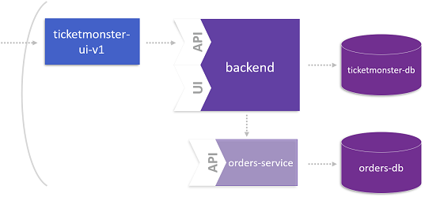

# The Microservice and its Domain Model

This lab is dedicated to the data management of the microservice we identified in the previous step. The overall goal is that the microservice consumes legacy data from the monolith but persists new data in its own database.

For more details about this lab, please take a look at the following blog post: [Identifying its Domain Model](https://www.dynatrace.com/news/blog/monolith-to-microservices-the-microservice-and-its-domain-model/).



## Step 1: Use Dynatrace to learn more about the Domain Model

1. Open service flow as explained in **Lab 4 - Identify a Microservice** at **Step 3**.
1. Follow the service flow through BookingService and your custom service. 
1. Click on the MySQL instance **ticketmonster** and on **View database statements**.

## Step 2: Create database for microservice

1. Create the database for the microservice.
    ```
    oc new-app --name=orders-db -e MYSQL_USER=ticket -e MYSQL_PASSWORD=monster -e MYSQL_DATABASE=orders mysql:5.5
    ```

## Step 3: Setup database

1. Switch to the `orders-service/` directory.

1. Get the name of the pod containing the DB.
    ```
    oc get pods
    ```

1. Copy initalization scripts into pod. These scripts will come from ```https://github.com/dynatrace-innovationlab/monolith-to-microservice-openshift.git``` which you should have cloned in the beginning.
    ```
    oc rsync src/main/resources/db/migration/ <your-db-pod>:/var/lib/mysql --no-perms=true
    ```

1. Connect to the DB Pod and execute SQL scripts
    ```
    oc rsh <your-db-pod>
    cd ~
    mysql -u root orders < 0_ordersdb-schema.sql
    mysql -u root orders < 1_ordersdb-data.sql
    exit
    ```

1. (optional) Set privileges on database `orders` for user `ticket`.
    ```
    oc rsh <your-db-pod>
    cd ~
    mysql -u root
    GRANT ALL PRIVILEGES ON `orders`.* TO 'ticket'@'%';
    exit
    exit
    ```

1. (optional) Check database `orders` in your pod.
    ```
    oc rsh <your-db-pod>
    cd ~
    mysql -u root
    GRANT ALL PRIVILEGES ON `orders`.* TO 'ticket'@'%';
    show databases;
    use orders;
    show tables;
    select * from id_generator;
    exit
    exit
    ```

1. Now, the database is prepared to store orders.

---

[Previous Step: Identify a Microservice](../4_Identify_a_Microservice) :arrow_backward: :arrow_forward: [Next Step: Deploy the Microservice](../6_Deploy_the_Microservice)

:arrow_up_small: [Back to overview](../)
