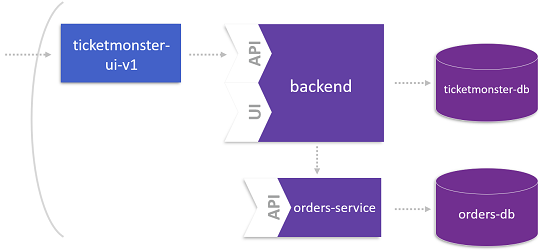
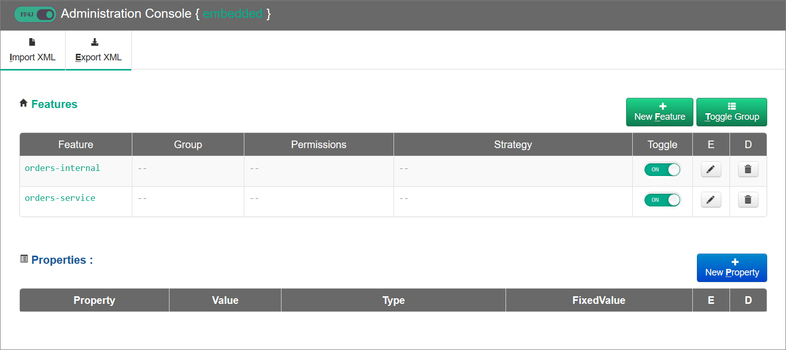
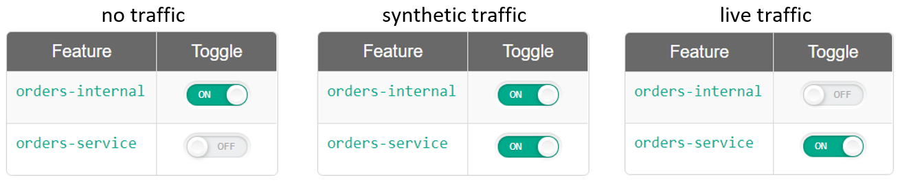

# Deploy the Microservice

Based on the result of the previous labs, you identified the microservice **OrdersService** that has its own code repository and defines its own domain model. To launch this service, it is not recommended to directly route traffic to this new service since we cannot fully ensure that it works as supposed. For this reason, we strangle the microservice around the monolith. In other words, all incoming requests will still be intercepted by the backend service, which forwards synthetic or live traffic to **OrdersService**.

In this lab you'll use feature flags and OpenShift routing mechanism to smoothly incorporate the new microservice into the monolith. The final state of this lab is shown below:



## Step 1: Deploy the Microservice

1. Create a new application representing the microservice **OrdersService**.
    ```
    oc new-app --docker-image=dynatraceacm/ticketmonster-orders-service:latest
    ```

1. Expose your microservice.
    ```
    oc expose service ticketmonster-orders-service --name=orders-service
    ```

## Step 2. Deploy a new backend version (v2) of the Monolith

1. Create a new version of the monolith that can deal with the microservice **OrdersService**.
    ```
    oc new-app -e MYSQL_SERVICE_HOST=ticketmonster-db -e MYSQL_SERVICE_PORT=3306 --docker-image=dynatraceacm/ticketmonster-backend-v2:latest
    ```

1. Expose the backend service.
    ```
    oc expose service ticketmonster-backend-v2 --name=backend-v2
    ```

1. Re-route the backend route to hit the new backend service.
    ```
    oc set route-backends backend ticketmonster-monolith=0 ticketmonster-backend-v2=100 
    ```

## Step 3: Switch feature flag and test your Microservice

1. In your browser, navigate to your `ff4j` console: `https://<your-backend>-XX.<ip>/ff4j-console`. You will be able to switch on/off your new microservice from here. 



1. Set the flags as shown for **life-traffic**.



1. When now order a ticket, the order will be operated and persisted by the **OrderService** instead of the monolithic booking service (in fact, the booking service calls the OrderService).

1. We can verify the service flow in Dynatrace.
    1. From the left menu, choose the **Transaction & services** tab.
    1. Select service **TicketMonsterUI**.
    1. Click on **View service flow**.
    1. Finally, you see the service flow containing the microservice `orders-service`.

---

[Previous Step: Domain Model of Microservice](../5_Domain_Model_of_Microservice) :arrow_backward: :arrow_forward: [Next Step: Clean up](../9_Clean_up)

:arrow_up_small: [Back to overview](../)